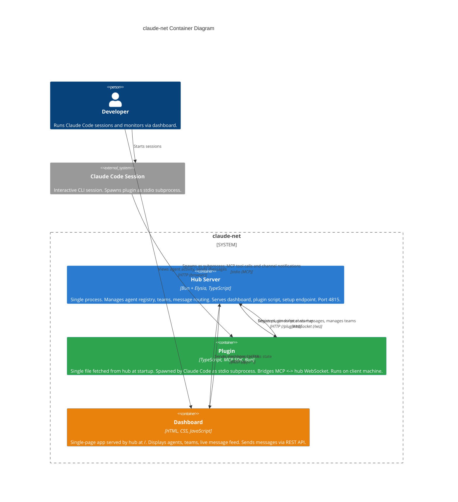

# Level 2: Container Diagram

```mermaid
C4Container
    title claude-net Container Diagram

    Person(developer, "Developer", "Runs Claude Code sessions and monitors via dashboard.")

    System_Ext(claudeCode, "Claude Code Session", "Interactive CLI session. Spawns plugin as stdio subprocess.")

    System_Boundary(claudeNet, "claude-net") {
        Container(hubServer, "Hub Server", "Bun + Elysia, TypeScript", "Single process. Manages agent registry, teams, message routing. Serves dashboard, plugin script, setup endpoint. Port 4815.")
        Container(plugin, "Plugin", "TypeScript, MCP SDK, Bun", "Single file fetched from hub at startup. Spawned by Claude Code as stdio subprocess. Bridges MCP <-> hub WebSocket. Runs on client machine.")
        Container(dashboard, "Dashboard", "HTML, CSS, JavaScript", "Single-page app served by hub at /. Displays agents, teams, live message feed. Sends messages via REST API.")
    }

    Rel(developer, dashboard, "Views agent activity, sends messages", "HTTP (browser)")
    Rel(developer, claudeCode, "Starts sessions")
    Rel(claudeCode, plugin, "Spawns as subprocess; MCP tool calls and channel notifications", "stdio (MCP)")
    Rel(plugin, hubServer, "Registers, sends/receives messages, manages teams", "WebSocket (/ws)")
    Rel(dashboard, hubServer, "Receives live events", "WebSocket (/ws/dashboard)")
    Rel(dashboard, hubServer, "Sends messages, queries state", "REST (/api/*)")
    Rel(hubServer, dashboard, "Serves dashboard HTML", "HTTP (/)")
    Rel(hubServer, plugin, "Serves plugin script at startup", "HTTP (/plugin.ts)")

    UpdateElementStyle(hubServer, $bgColor="#2B7CD0", $fontColor="#ffffff")
    UpdateElementStyle(plugin, $bgColor="#2EA44F", $fontColor="#ffffff")
    UpdateElementStyle(dashboard, $bgColor="#E8820C", $fontColor="#ffffff")
    UpdateElementStyle(claudeCode, $bgColor="#999999", $fontColor="#ffffff")
```
