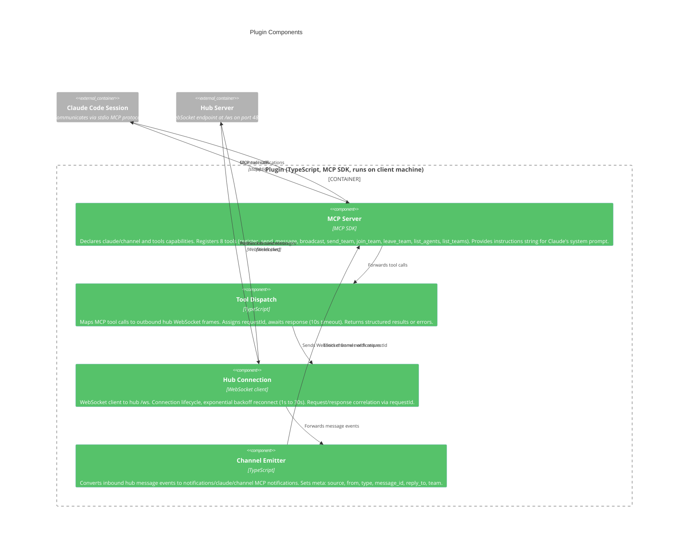

# Level 3: Plugin Component Diagram

```mermaid
C4Component
    title Plugin Components

    Container_Ext(claudeCode, "Claude Code Session", "Communicates via stdio MCP protocol")
    Container_Ext(hubServer, "Hub Server", "WebSocket endpoint at /ws on port 4815")

    Container_Boundary(plugin, "Plugin (TypeScript, MCP SDK, runs on client machine)") {
        Component(mcpServer, "MCP Server", "MCP SDK", "Declares claude/channel and tools capabilities. Registers 8 tools (register, send_message, broadcast, send_team, join_team, leave_team, list_agents, list_teams). Provides instructions string for Claude's system prompt.")
        Component(toolDispatch, "Tool Dispatch", "TypeScript", "Maps MCP tool calls to outbound hub WebSocket frames. Assigns requestId, awaits response (10s timeout). Returns structured results or errors.")
        Component(hubConnection, "Hub Connection", "WebSocket client", "WebSocket client to hub /ws. Connection lifecycle, exponential backoff reconnect (1s to 30s). Request/response correlation via requestId.")
        Component(channelEmitter, "Channel Emitter", "TypeScript", "Converts inbound hub message events to notifications/claude/channel MCP notifications. Sets meta: source, from, type, message_id, reply_to, team.")
    }

    Rel(claudeCode, mcpServer, "MCP tool calls", "stdio")
    Rel(mcpServer, toolDispatch, "Forwards tool calls")
    Rel(toolDispatch, hubConnection, "Sends WebSocket frames with requestId")
    Rel(hubConnection, hubServer, "WebSocket connection", "WebSocket (/ws)")
    Rel(hubServer, hubConnection, "Pushes inbound messages", "WebSocket")
    Rel(hubConnection, channelEmitter, "Forwards message events")
    Rel(channelEmitter, mcpServer, "Emits channel notifications")
    Rel(mcpServer, claudeCode, "Channel notifications", "stdio")

    UpdateElementStyle(mcpServer, $bgColor="#56C26A", $fontColor="#ffffff")
    UpdateElementStyle(toolDispatch, $bgColor="#56C26A", $fontColor="#ffffff")
    UpdateElementStyle(hubConnection, $bgColor="#56C26A", $fontColor="#ffffff")
    UpdateElementStyle(channelEmitter, $bgColor="#56C26A", $fontColor="#ffffff")
```
